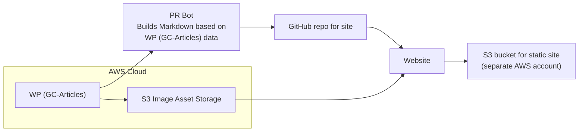

# Architecture Decision Record: Website Infrastructure

## Date
May 1, 2025

## Status
Accepted

## Context
The GCDS Protospace requires a website infrastructure that enables content designers to experiment with the Government of Canada Design System (GCDS) components in a safe environment. The infrastructure needs to support:

1. Multilingual content (English and French)
2. Component-based design system integration
3. Fast and secure prototyping
4. Easy content creation and modification
5. Government of Canada design standards compliance
6. Open-source development
7. Collaborative workflow

## Decision
We have decided to implement the website using the following architecture:

1. **Static Site Generator**: [Hugo](https://gohugo.io/) - A fast and flexible open-source static site generator with built-in render hooks for customizing Markdown-to-HTML conversion
2. **Theme**: Custom `hugo-gcds` theme that implements GCDS components and leverages Hugo's render hooks for consistent styling
3. **Design System**: Government of Canada Design System (GCDS) components via CDN integration
4. **Multilingual Support**: Hugo's built-in i18n capabilities
5. **Development Environment**: Docker containerization with VS Code Dev Containers
6. **Deployment**: Static site hosting with CI/CD pipeline

### Architecture Components

#### 1. Hugo Framework
- **Version**: Latest extended version
- **Configuration**: Via `hugo.toml` and `config.toml` at the root level
- **Advantages**: Fast build times, markdown content, flexible templating, built-in i18n

#### 2. Custom Theme (hugo-gcds)
- **Location**: `/themes/hugo-gcds/`
- **Structure**:
  - **Layouts**: HTML templates for pages, partials, and shortcodes
  - **Assets**: CSS and JavaScript files
  - **i18n**: Translation files for multilingual support

#### 3. GCDS Components Integration
- **Implementation**: Web components loaded from CDN
- **CDN URLs**:
  - https://cdn.design-system.alpha.canada.ca/@cdssnc/gcds-utility@1.8.0/dist/gcds-utility.min.css
  - https://cdn.design-system.alpha.canada.ca/@cdssnc/gcds-components@0.34.2/dist/gcds/gcds.css
  - https://cdn.design-system.alpha.canada.ca/@cdssnc/gcds-components@0.34.2/dist/gcds/gcds.esm.js
- ~~**Local Dependency**: `@cdssnc/gcds-components` in `package.json`~~

#### 4. Content Structure
- **Organization**: `/content/{language}/`
- **Format**: Markdown files with frontmatter and shortcodes
- **Categories**: Content organization via Hugo content types and taxonomies

#### 5. Multilingual Implementation
- **Default language**: English (en)
- **Secondary language**: French (fr)
- **Configuration**: Language settings in `hugo.toml`
- **URL Structure**: Language in subpath (e.g., `/en/` and `/fr/`)
- **Translation**: i18n files in `/i18n/` directory

#### 6. Development Environment
- **Containerization**: Docker via Dev Containers
- **IDE Integration**: VS Code with recommended extensions
- **Local Server**: Hugo development server with live reload
- **Tasks**: Pre-configured VS Code tasks for common operations

#### 7. Build Process
- **Development Build**: `hugo server` with drafts enabled
- **Production Build**: `hugo --minify` for optimized output
- **Output**: Static files in `/public/` directory

## Consequences

### Advantages
1. **Performance**: Static site generation provides fast page loads and excellent security
2. **Developer Experience**: Local development environment with live reload speeds up prototyping
3. **Content Management**: Markdown content is easy to create and maintain
4. **Flexibility**: Hugo's template system allows for custom layouts and design patterns
5. **Standards Compliance**: Direct integration with GCDS ensures design standard compliance
6. **Multilingual Support**: Built-in i18n features simplify content translation
7. **Collaboration**: Git-based workflow enables team collaboration and version control
8. **Accessibility**: GCDS components are designed with accessibility in mind
9. **Portability**: Static output can be hosted on any web server or CDN

### Challenges
1. **Learning Curve**: Team members need to be familiar with Hugo, Markdown, and Git
2. **Component Updates**: Changes to GCDS components may require theme updates
3. **Build Process**: Additional steps needed for production deployment
4. **Dynamic Features**: Limited dynamic functionality without additional JavaScript
5. **Custom Hooks**: Hugo lacks built-in hooks for paragraph-level elements, requiring manual `gcds-text` component implementation for each paragraph

### Mitigations
1. **Documentation**: Comprehensive readme and setup instructions in `.devcontainer/README.md`
2. **Version Pinning**: Explicit versions for GCDS components to prevent breaking changes
3. **Automation**: VS Code tasks and scripts to streamline common operations
4. **Progressive Enhancement**: Design patterns that work well with and without JavaScript

## Compliance
This architecture aligns with the Government of Canada Digital Standards by:
- Using open-source tools and frameworks
- Ensuring bilingual content delivery
- Implementing accessible design patterns
- Supporting iterative development and testing
- Providing a platform for secure and privacy-respecting prototyping

## References
1. [Hugo Documentation](https://gohugo.io/documentation/)
2. [GC Design System Documentation](https://design-system.alpha.canada.ca/)
3. [Government of Canada Digital Standards](https://www.canada.ca/en/government/system/digital-government/government-canada-digital-standards.html)
4. [Web Experience Toolkit](https://wet-boew.github.io/wet-boew/index-en.html)